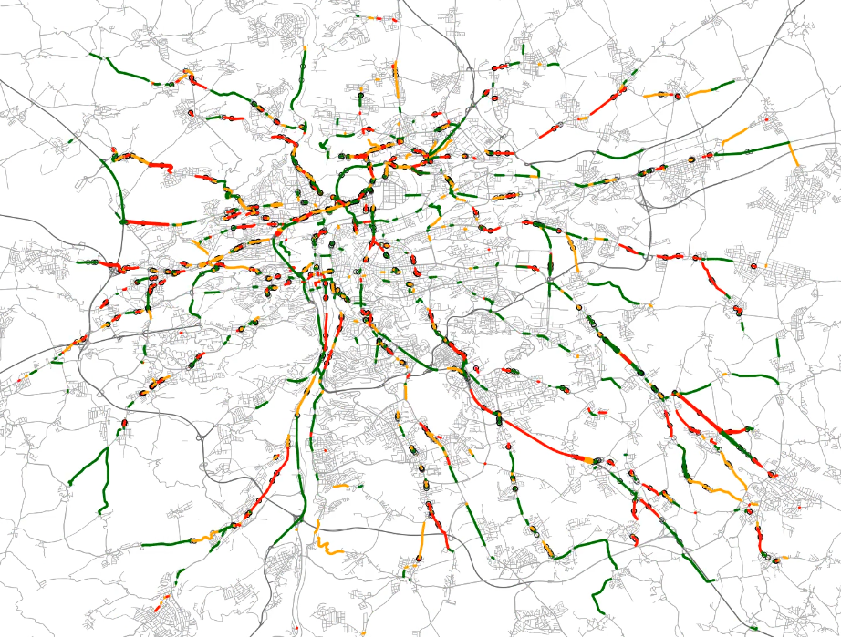

# FlowMapVideo

FlowMapVideo is a tool for visualizing the evolution of traffic flow over time. The output is a video with a map showing the traffic flow intensities at each time interval. The animation is generated using the [FlowMapFrame](flowmap/flowmapframe) library to render individual frames based on the output of the [Ruth](https://github.com/It4innovations/ruth) traffic simulator. It is designed for linux systems.



## Installation

### Prerequisites

1. Install `FFmpeg`:

    ```
    sudo apt install ffmpeg
    ```
2. Install [Ruth](https://github.com/It4innovations/ruth).

### Install

1. Activate the virtual environment where Ruth is installed

2. Install via pip
```
python3 -m pip install git+https://code.it4i.cz/mic0427/traffic-flow-map.git
```

## Run
```
traffic-flow-map --help
```

### Check the animation length
use `get-info` to check the animation length for given data and speed
```
traffic-flow-map get-info --help
```
with parameters:
* `--time-unit` - time unit of the information about the animation
* `--speed` - speed of the animation

### Generate the animation
#### Traffic volume animation
Animation depicts the amount of the vehicles using both color and width of the routes.

use `generate-volume-animation`:
```
traffic-flow-map generate-volume-animation --help
```

#### Traffic speed animation
Animation uses colors to visualize current speed on the route. Volume of the traffic is depicted by the width of the routes.

use `generate-speeds-animation`:
```
traffic-flow-map generate-speeds-animation --help
```

#### Example
```
traffic-flow-map generate-speeds-animation <PATH_TO_DATA> --speed 350 --title "Traffic flow" -c
```
* use `--title` to set your title
* use `-c` parameter to animate the movement of the vehicles

Don't forget to specify the `--speed` parameter that was tested with `get-info` command.

For fixed number of vehicles that will be depicted with maximum line width, use the `--max-width-density` parameter (important when making multiple videos to compare).


### Get more detailed information about the simulation
* use `get-info --minute n` to get more detailed information about n<sup>th</sup> minute of the simulation
    #### Example 
    get info about 5<sup>th</sup> minute
    ```
    traffic-flow-map get-info <PATH_TO_DATA> --minute 5
    ```
* use `get-info --status-at-point` to get information about the simulation at given point of completion
    #### Example 
    get simulation status at point when 50% of vehicles reached their destination
    ```
    traffic-flow-map get-info <PATH_TO_DATA> --status-at-point 0.5
    ```

