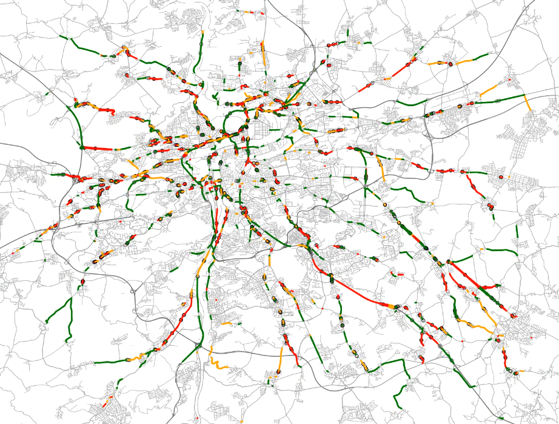

# FlowMapVideo

FlowMapVideo is a tool for visualizing the evolution of traffic flow over time. The output is a video with a map showing the traffic flow intensities at each time interval. The animation is generated using the [FlowMapFrame](flowmapframe) library to render individual frames based on the output of the [Ruth](https://github.com/It4innovations/ruth) traffic simulator. It is designed for linux systems.



## Installation

### Prerequisites

1. Install or load necessary dependencies: python, cmake, hdf5, openMPI and ffmpeg.
  ```
ml Python/3.11.3-GCCcore-12.3.0
ml CMake/3.26.3-GCCcore-12.3.0
ml HDF5/1.14.0-gompi-2023a
ml OpenMPI/4.1.5-GCC-12.3.0
ml FFmpeg/6.0-GCCcore-12.3.0 
  ```
2. Clone and install [Ruth](https://github.com/It4innovations/ruth).
```
git clone --recurse-submodules -b cpp-video  https://github.com/It4innovations/ruth.git
python -m venv venv_video
source venv_video/bin/activate
cd ruth
pip install .
```

## Build and run preprocessing
Use cpp tool to generate data for the animation.

```
cd ruth/binding/video
mkdir build
cd build
cmake ..
make
./video_preprocess -h
```

```
---filename : input file with Ruth simulation data in HDF5 format (default: fcd_history.h5)
---outfile : output file for preprocessed data in HDF5 format (default: fcd_aggregated.h5)
---length : length of the output video in seconds (default 60)
---fps : frames per second in the output video (default 25)
---maxrecords : maximum number of records to consider in the visualization (optional)
```
### Example
```
./video_preprocess --filename fcd_history.h5 --outfile fcd_aggregated.h5 --length 30
```

## Run video generation CLI tool
```
traffic-flow-map --help
```

### Generate the animation
#### Traffic volume animation
Animation depicts the amount of the vehicles using both color and width of the routes.

use `generate-volume-animation`:
```
traffic-flow-map generate-volume-animation --help
```

#### Traffic speed animation
Animation uses colors to visualize current speed on the route. Volume of the traffic is depicted by the width of the routes.

use `generate-speeds-animation`:
```
traffic-flow-map generate-speeds-animation --help
```

#### Example
```
traffic-flow-map generate-speeds-animation aggregated_fcd.h5 --dask_workers 20 --title "Traffic flow" --description_path "description.txt"
```

For fixed number of vehicles that will be depicted with maximum line width, use the `--max-width-density` parameter (important when making multiple videos to compare).  

### Parallelization with Dask
If `--dask-workers` is not specified, the tool will run in single-threaded mode.
If it is specified, the tool will use Dask to parallelize the frame rendering across multiple workers,
where each worker will render a subset of the frames into separate image files, which will then be combined into a video.

## Get more detailed information about the simulation
* use `get-info` to get simulation length
    #### Example
    ```
    traffic-flow-map get-info <PATH_TO_DATA>
    ```
* use `get-info --minute n` to get more detailed information about n<sup>th</sup> minute of the simulation
    #### Example 
    get info about 5<sup>th</sup> minute
    ```
    traffic-flow-map get-info <PATH_TO_DATA> --minute 5
    ```
* use `get-info --status-at-point` to get information about the simulation at given point of completion
    #### Example 
    get simulation status at point when 50% of vehicles reached their destination
    ```
    traffic-flow-map get-info <PATH_TO_DATA> --status-at-point 0.5
    ```
### Generate CSV file with simulation progress
* generate from fcd_history.h5 file, not from preprocessed aggregated file
* generate CSV file with data calculated for every n minutes of the simulation
* use `get-comparison-csv` to generate CSV file with simulation progress for 5 minute intervals
    #### Example 
    ```
    traffic-flow-map get-comparison-csv <PATH_TO_INPUT_DIR> --output-dir <PATH_TO_OUTPUT_CSV> --interval 5
    ```
* CSV columns contain:
    * time offset,
    * number of active vehicles in time interval & since start,
    * columns with number of vehicles with different alternative route algorithm,
    * columns with number of vehicles with different alternative route selection,
    * number of vehicles that finished journey in time interval & since start,
    * total meters driven in time interval & since start,
    * total driving time in time interval & since start,
    * number of segments visited in time interval & since start,
    * average speed in time interval & since start,
    * number of segments in different speed ranges in time interval & since start,
    * number of vehicles in different speed ranges in time interval & since start.
